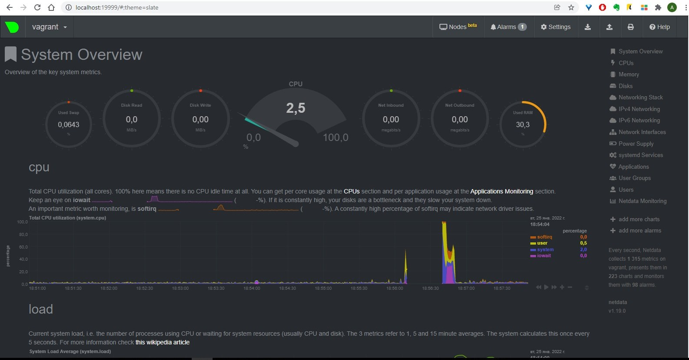

# Домашнее задание к занятию "3.4. Операционные системы, лекция 2"

(1)

```
sudo nano /etc/systemd/system/node_exporter.service
root@vagrant:~# systemctl daemon-reload
root@vagrant:~# systemctl enable node_exporter
root@vagrant:~# systemctl start node_exporter
root@vagrant:~# systemctl enable --now node_exporter
root@vagrant:~# systemctl status node_exporter
● node_exporter.service - Node Exporter Service
     Loaded: loaded (/etc/systemd/system/node_exporter.service; enabled; vendor preset: enabled)
     Active: active (running) since Mon 2022-01-24 14:26:33 UTC; 1min 22s ago
   Main PID: 1460 (node_exporter)
      Tasks: 4 (limit: 1071)
     Memory: 2.4M
     CGroup: /system.slice/node_exporter.service
             └─1460 /usr/local/bin/node_exporter

Jan 24 14:26:33 vagrant node_exporter[1460]: ts=2022-01-24T14:26:33.595Z caller=node_exporter.go:115 level=info collector=thermal_zone
Jan 24 14:26:33 vagrant node_exporter[1460]: ts=2022-01-24T14:26:33.595Z caller=node_exporter.go:115 level=info collector=time
Jan 24 14:26:33 vagrant node_exporter[1460]: ts=2022-01-24T14:26:33.595Z caller=node_exporter.go:115 level=info collector=timex
Jan 24 14:26:33 vagrant node_exporter[1460]: ts=2022-01-24T14:26:33.595Z caller=node_exporter.go:115 level=info collector=udp_queues
Jan 24 14:26:33 vagrant node_exporter[1460]: ts=2022-01-24T14:26:33.595Z caller=node_exporter.go:115 level=info collector=uname
Jan 24 14:26:33 vagrant node_exporter[1460]: ts=2022-01-24T14:26:33.595Z caller=node_exporter.go:115 level=info collector=vmstat
Jan 24 14:26:33 vagrant node_exporter[1460]: ts=2022-01-24T14:26:33.595Z caller=node_exporter.go:115 level=info collector=xfs
Jan 24 14:26:33 vagrant node_exporter[1460]: ts=2022-01-24T14:26:33.595Z caller=node_exporter.go:115 level=info collector=zfs
Jan 24 14:26:33 vagrant node_exporter[1460]: ts=2022-01-24T14:26:33.595Z caller=node_exporter.go:199 level=info msg="Listening on" address=:9100
Jan 24 14:26:33 vagrant node_exporter[1460]: ts=2022-01-24T14:26:33.596Z caller=tls_config.go:195 level=info msg="TLS is disabled." http2=false
root@vagrant:~# ss -pnltu | grep 9100
tcp     LISTEN   0        4096                    *:9100                *:*      users:(("node_exporter",pid=1460,fd=3))
root@vagrant:~# ps -e |grep node_exporter
   1460 ?        00:00:00 node_exporter
root@vagrant:~# systemctl stop node_exporter
root@vagrant:~# ps -e |grep node_exporter
root@vagrant:~# systemctl start node_exporter
root@vagrant:~# ps -e |grep node_exporter
   2387 ?        00:00:00 node_exporter
```

Прописан конфигурационный файл - /etc/systemd/system/node_exporter.service :

```
[Unit]
Description=Node Exporter Service
After=network.target

[Service]
User=node_exporter
Group=node_exporter
Type=simple
ExecStart=/usr/local/bin/node_exporter
ExecReload=/bin/kill -HUP $MAINPID
Restart=on-failure

[Install]
WantedBy=multi-user.target
```

(2)


(3)




(4)

Да, ОС осознает что загружена в системе виртуализации:

```
root@vagrant:~# dmesg |grep -i virtual
[    0.000000] DMI: innotek GmbH VirtualBox/VirtualBox, BIOS VirtualBox 12/01/2006
[    0.003730] CPU MTRRs all blank - virtualized system.
[    0.106118] Booting paravirtualized kernel on KVM
[    3.116593] systemd[1]: Detected virtualization oracle.
```

(5)

Лимит на количество открытых дескрипторов. 

```
root@vagrant:~# /sbin/sysctl -n fs.nr_open
1048576
```

-n        the maximum number of open file descriptors

(6)

В первом терминале:

```
root@vagrant:~# unshare -f --pid --mount-proc sleep 5m
```

Во втором терминале:

```
root@vagrant:~# ps -e | grep sleep                                             
   1559 pts/0    00:00:00 sleep                                                
root@vagrant:~# nsenter --target 1559 --mount --uts --ipc --net --pid ps aux   
USER         PID %CPU %MEM    VSZ   RSS TTY      STAT START   TIME COMMAND     
root           1  0.0  0.0   5476   596 pts/0    S+   16:39   0:00 sleep 5m    
root           2  0.0  0.3   8892  3364 pts/1    R+   16:41   0:00 ps aux      
root@vagrant:~#                                                                
```

(7)

Команда :(){ :|:& };: -  является логической бомбой. Она оперирует определением функции с именем ‘:‘, которая вызывает сама себя дважды: один раз на переднем плане и один раз в фоне. Она продолжает своё выполнение снова и снова, пока система не зависнет.

механизм защиты:

```
 dmesg | grep fork
[ 3100.953725] cgroup: fork rejected by pids controller in /user.slice/user-1000.slice/session-1.scope
```

```
limit -u	the maximum number of user processes - настраивает количество процессов на пользователя
```

значения по умолчанию:

```
root@vagrant:~# ulimit -a
core file size          (blocks, -c) 0
data seg size           (kbytes, -d) unlimited
scheduling priority             (-e) 0
file size               (blocks, -f) unlimited
pending signals                 (-i) 3571
max locked memory       (kbytes, -l) 65536
max memory size         (kbytes, -m) unlimited
open files                      (-n) 1024
pipe size            (512 bytes, -p) 8
POSIX message queues     (bytes, -q) 819200
real-time priority              (-r) 0
stack size              (kbytes, -s) 8192
cpu time               (seconds, -t) unlimited
max user processes              (-u) 3571
virtual memory          (kbytes, -v) unlimited
file locks                      (-x) unlimited
```
